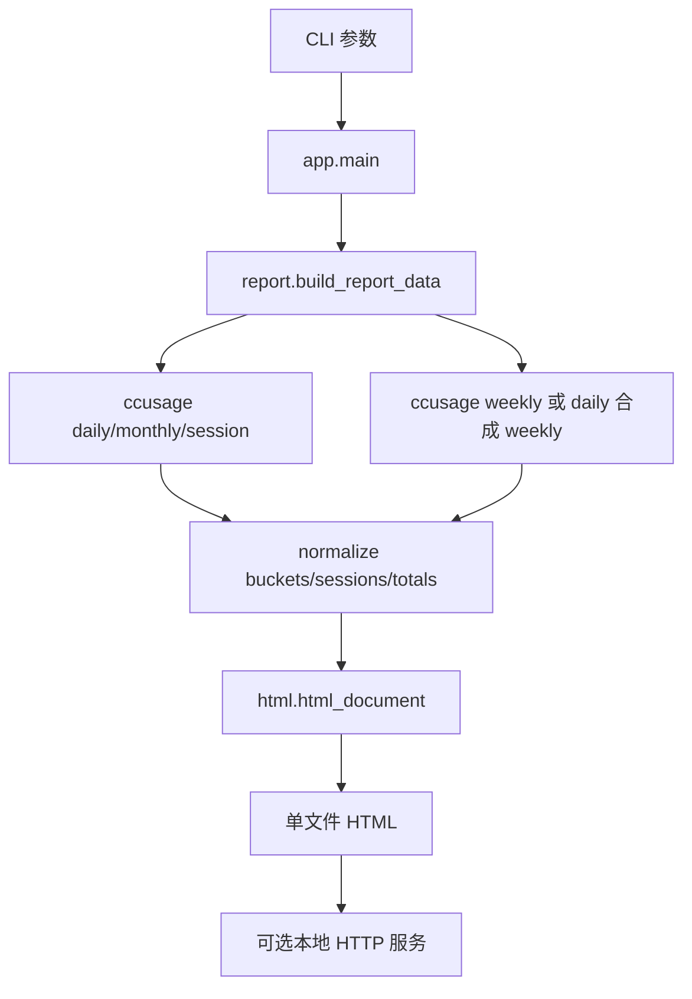

# ccusage-html Wiki v0.0.1

## 项目定位

`ccusage-html` 用来把本机 `ccusage` 的 JSON 数据生成一个现代、可交互、可归档的 HTML 用量看板。它既可以作为 Codex skill 使用，也可以作为独立 Python 脚本运行。

## 快速开始

在项目根目录运行：

```powershell
uv run python .\scripts\generate_ccusage_report.py all --serve --port 8765
```

脚本会生成 HTML 文件，并打印本地访问地址：

```text
http://127.0.0.1:8765/ccusage-report-*.html
```

常用示例：

```powershell
uv run python .\scripts\generate_ccusage_report.py codex --since 2026-06-01 --until 2026-06-30
uv run python .\scripts\generate_ccusage_report.py codex --timezone Asia/Shanghai --speed auto
uv run python .\scripts\generate_ccusage_report.py cc --offline --no-transcript
uv run python .\scripts\generate_ccusage_report.py gemini --no-transcript
uv run python .\scripts\generate_ccusage_report.py all --output .\ccusage-report.html
```

## 当前功能

- 支持 `all`、`codex`、`cc`、`claude`、`gemini` 等 agent 选择方式。
- 支持 daily、weekly、monthly 三类时间桶。
- 支持总量和各模型的分组柱状图。
- 支持用量曲线图。
- 支持 Usage、Models、Sessions 顶层 tab。
- 支持 session 卡片/列表切换、搜索、排序和图表联动过滤。
- 支持 Codex 本地 transcript 片段提取。
- 支持 `--serve` 启动本地 HTTP 服务。

## 代码结构

当前结构保留模块化，但避免拆得过碎：

```text
scripts/
├─ generate_ccusage_report.py
└─ ccusage_html_report/
   ├─ __init__.py
   ├─ app.py
   ├─ cli.py
   ├─ ccusage.py
   ├─ report.py
   └─ html.py
```

模块职责：

| 文件 | 职责 |
| --- | --- |
| `generate_ccusage_report.py` | 兼容 CLI 入口。 |
| `app.py` | 应用编排、默认输出路径、本地 HTTP 服务。 |
| `cli.py` | 命令行参数解析。 |
| `ccusage.py` | agent 别名、`ccusage` 命令构造和 JSON 执行。 |
| `report.py` | token、模型、周期、session、transcript 和 totals 的数据规整。 |
| `html.py` | 单文件 HTML、CSS、前端交互脚本渲染。 |

## 数据流



## Transcript 说明

Codex transcript 支持最完整。脚本会尝试通过 session 信息定位：

```text
~/.codex/sessions/**/*.jsonl
```

提取策略：

- 只保留 user 和 assistant 消息。
- 跳过大型系统上下文、环境上下文和 agent instructions。
- 默认每个 session 最多 6 条 snippet，每条最多 420 个字符。
- 生成的 HTML 可能包含本地聊天片段，应视为私有数据。

## 开发验证

语法检查：

```powershell
& 'E:\Environments\uv\py312\Scripts\python.exe' -m compileall -q scripts
```

CLI 检查：

```powershell
& 'E:\Environments\uv\py312\Scripts\python.exe' .\scripts\generate_ccusage_report.py --help
```

真实生成：

```powershell
uv run python .\scripts\generate_ccusage_report.py all --serve --port 8765
```

## v0.0.1 待办

- 确认 `all` 模式下分模型查看是否完整。
- 增强 total cost 和各 session/model 成本展示。
- 支持 session 展开详情，展示更完整的 token、cost 和上下文信息。
- 评估是否将默认输出改为项目内 `reports/时间戳/` 并提供历史入口。

